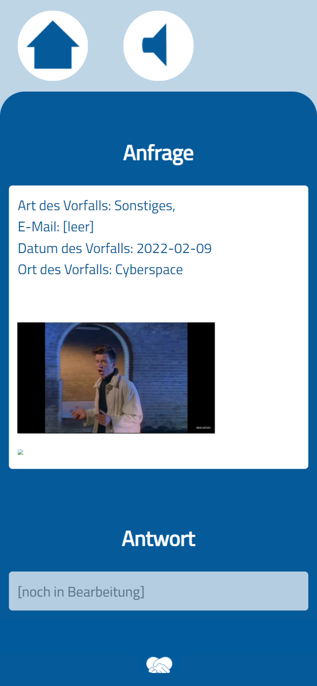

---
title: Respect@THI App Vulnerabilities
author: Jakob Löw, Dominik Bayerl
date: 10.02.2022
documentclass: scrartcl
classoption:
    - 12pt
    - a4paper
    - final
    - oneside
geometry:
    - a4paper
    - left=3.5cm
    - right=2.5cm
    - top=3cm
    - bottom=2cm
    - headheight=2.5cm
    - headsep=0.5cm
    - footskip=1cm
mainfont: DejaVu Serif
monofont: DejaVu Sans Mono
titlegraphic: thi_logo.eps
header-includes: |
    \usepackage[onehalfspacing]{setspace}
    \usepackage{parskip}

    \newcommand{\HRule}{\rule{\linewidth}{0.5mm}}
    \renewcommand{\sectionmark}[1]{\markboth{\thesection \ #1}{}}
    \renewcommand{\subsectionmark}[1]{\markright{\thesubsection\ #1}}
    \newcommand{\sectionnumbering}[1]{
        \setcounter{section}{0}
        \renewcommand{\thesection}{\csname #1\endcsname{section}}
    }
    \pagenumbering{arabic}
    \sectionnumbering{Roman}

    \usepackage[headsepline,footsepline]{scrlayer-scrpage}
    \pagestyle{scrheadings}
    \ihead{\includegraphics[height=2cm]{thi_logo.eps}}
    \chead{}
    \ohead{\leftmark}
    \ifoot{}
    \cfoot{}
    \ofoot{\thepage}

    \providecommand{\versionortoday}{\today}
    \usepackage{blindtext}
...

# Introduction
\Blindtext

# Vulnerabilities
- Open Redirect bei respect/app/activated/www/api/setLanguage.php:12
- Open Redirect bei respect/app/activated/www/api/sendMessage.php:56
- Open Redirect bei respect/app/activated/www/api/sendMessage.php:60
- HTML piggy back request über HTTP_COOKIE in respect/app/activated/www/ui/index.php
- Mehrere Nutzer bekommt selben one-time-code in respect/modules/OneTimeCodeGenerator.class.php
- one-time-code lässt sich mehrfach benutzen in respect/modules/OneTimeCodeGenerator.class.php
- LDAP search string is not sanitized in respect/modules/LDAPService.class.php
- Secrets in Code respect/modules/UserCredentials.class.php
- Secrets in Code respect/modules/Token.class.php:5
- Secrets in Code respect/modules/OneTimeCodeGenerator.class.php:5
- E-Mail XSS in respect/management/www/authorized/user/index.php:45-47 
- XSS Frontend bei /app/activated/www/index.php
    - { height=7cm }
- XSS Backend(?) bei /app/management/www/authorized/answer/index.php
- CSRF in respect/app/activated/www/api/setLanguage.php (GET-Request mit State-Change)
    - Aber: Mitigations in Chrome & Firefox seit August 2020
    - Vorschlag: `SameSite=Strict`
- Hash length extension attack bei Tokens möglich(?)
    - Hier nicht, da der geheime Schlüssel hinten appended wird ($H(m||k)$ statt $H(k||m)$)
    - HMAC verwenden! Gefährliche Konstruktion
    - Generell: Besser JWTs verwenden!
- Infinite redirect login->ui->login->ui... wenn Token invalid oder abgelaufen.
- Code duplizieren 

# Summary
\Blindtext
